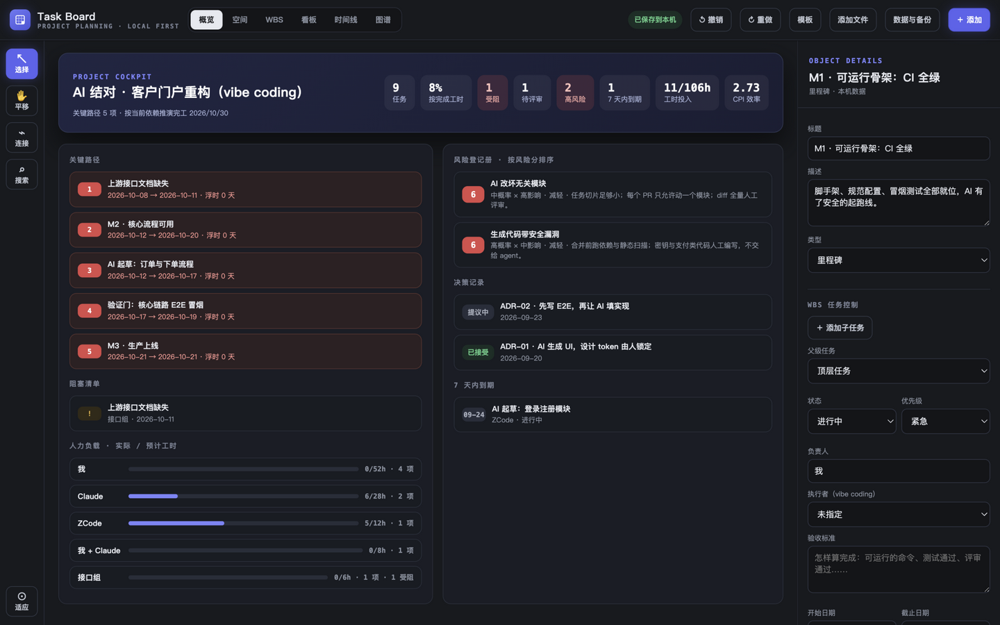
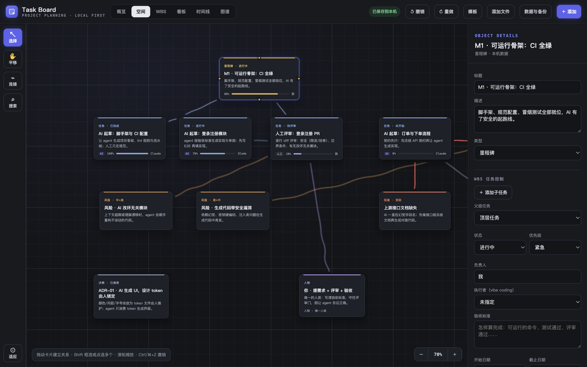
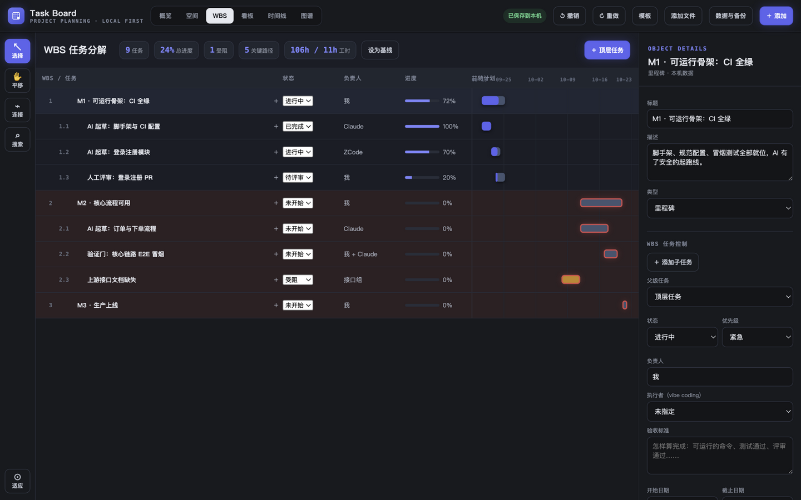
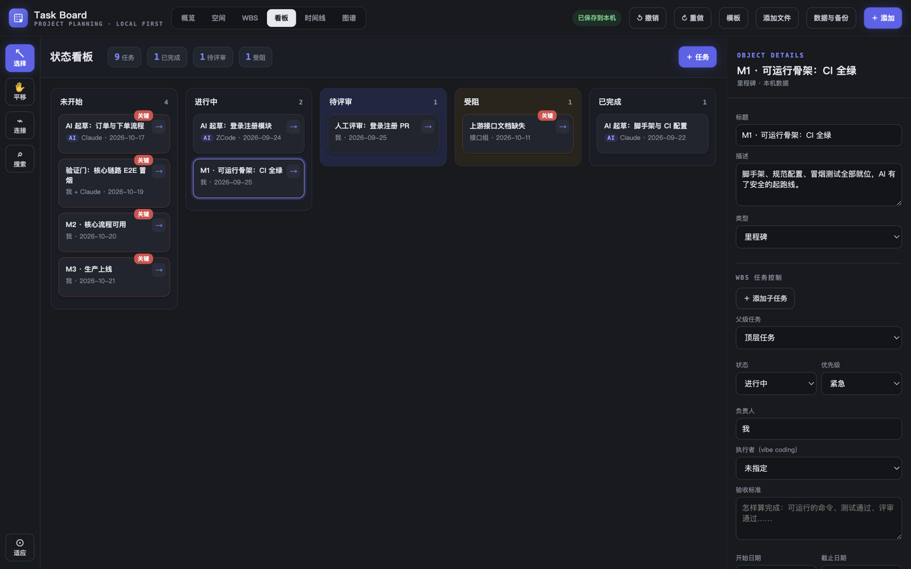

<div align="center">

# Task Board · 技术项目管理面板

*原名 Weaveboard*

**单文件 HTML 的离线项目管理看板——数据永不离机。为 vibe coding 而生：AI 起草 → 人工评审 → 验证完成。**

AI 结对工作流（执行者标注 · 验收标准 · 待评审环节）· WBS 任务分解 · CPM 关键路径 · 基线与偏差 · SPI/CPI 效率 · 风险登记册 · ADR 决策记录 · 状态看板 · Excel / Word 导出

*Obsidian 暗色工作室：中性深底、靛蓝霓光点缀、发光的关键路径绳索——vibe coding 的原生栖息地。*

[](LICENSE)
[](#)
[](#)

**[🌐 在线体验](https://tohnee.github.io/weaveboard/)** · **[English](README.md)**

</div>

---



大多数项目管理工具要账号、要服务器、要你的数据。Task Board 反其道而行：**一个 HTML 文件、零依赖、数据只存在你的浏览器里**。双击打开就是一个完整的技术项目管理驾驶舱——任务分解、依赖网络、关键路径推演、风险登记、决策记录，以及真正的 Excel / Word 导出。它同时是一个 **agent skill**：AI 助手可以把一份项目简报直接变成可用的看板文件。

## 核心特性

| | |
|---|---|
| **空间画布** — 物理绳索连接卡片，关键路径红色高亮，连线永不穿过卡片内部。 |  |
| **WBS + 甘特** — 自动编号、按工时加权汇总进度、浮时提示、关键行高亮。 |  |
| **状态看板** — 未开始/进行中/受阻/已完成四列流转，一键推进，关键路径角标。 |  |
| **概览驾驶舱** — 进度、受阻、高风险、7 天内到期、工时投入、关键路径链一屏尽收。 |  |

**项目管理机制**

- 依赖管理（PDM）：FS / SS / FF / SF 四种依赖类型 + 滞后天数，属性面板内直接编辑
- 关键路径（CPM）：按起止日期与依赖前向/后向推演，浮时与零浮时链在四个视图联动高亮，改数据即时重算
- **基线与偏差**：WBS 一键"设为基线"，甘特以虚线保留基线条，汇总条实时显示最大顺延天数（基线偏差 chip）
- **SPI/CPI 工程效率**：EV/PV 进度绩效与 EV/AC 投入效率自动计算（口径依赖工时纪律），低于 0.9 概览标红
- **人力负载**：按负责人汇总实际/预计工时与受阻数，超载标橙，为资源调配提供依据
- 风险登记册：概率 × 影响 = 1–9 风险分，应对策略（减轻/规避/转移/接受）与措施，高分风险自动进驾驶舱
- 决策记录（ADR）：提议中/已接受/已替代/已废弃状态机 + 决策日期
- 时间线 / 图谱视图、旅行规划模板（按天行程、双币种预算、预订状态）

**基础能力**：LocalStorage 自动保存 + 12 份快照、40 步撤销重做、多选成组拖动、IndexedDB 附件、`prefers-reduced-motion` 无障碍支持。

## 快速开始

1. 下载 [`weaveboard-offline.html`](weaveboard-offline.html)（或直接[在线体验](https://tohnee.github.io/weaveboard/)）
2. 双击打开，默认载入示例项目「交易链路重构」
3. 点「模板」可切换旅行规划看板；「数据与备份」里导出 Excel / Word / JSON / ZIP

## Agent Skill

[`skills/weaveboard-pm/`](skills/weaveboard-pm/) 是完整的 agent skill：把项目简报交给 AI，它生成经过校验的看板文件。

```bash
# 安装到 agent 的技能目录（ZCode / Claude Code 风格）
cp -r skills/weaveboard-pm ~/.zcode/skills/        # 或 ~/.claude/skills/
```

skill 强制执行验证闭环：数据必须通过 `validate_board.mjs`（15+ 条规则 + CPM 无头复算）才会生成看板：

```bash
node scripts/validate_board.mjs examples/api-refactor.weaveboard.json
node scripts/new_board.mjs  examples/api-refactor.weaveboard.json -o 我的看板.html
```

数据契约：[`references/schema.md`](skills/weaveboard-pm/references/schema.md) · 编写规范：[`authoring.md`](skills/weaveboard-pm/references/authoring.md)

### DeepSeek Harness 插件（dsh bundle）

[`harness/deepseek/`](harness/deepseek/) 是面向官方 [DeepSeek Harness](https://github.com/deepseek-ai/deepseek-harness)（`dsh`，"Everything is a Plugin"，Cordis 内核）的正规插件，按其公开的 bundle 规范编写：`package.json` 声明 `dsh.bundle` 清单 + `cordis.patch.yml` 配置层 + `index.js` 用 `defineTool` 向 `ctx.tools` 注册四个工具（`weaveboard_validate_board` / `weaveboard_new_board` / `weaveboard_inject_data` / `weaveboard_sync_engine`）。安装：`dsh plugin --profile <name> add ./harness/deepseek`。工具链（白名单、工作目录/插件目录路径边界、`shell:false`、`{ok, output}` 规范返回值）已对官方发布的 `@deepseek-ai/dsh-tools` 做过冒烟验证，详见其 [README](harness/deepseek/README.md)。

## 数据安全

结构数据存 LocalStorage、附件存 IndexedDB——**全部只在当前浏览器与设备**。清理浏览器数据前请先导出 JSON。

## 许可

[MIT](LICENSE) © 2026
